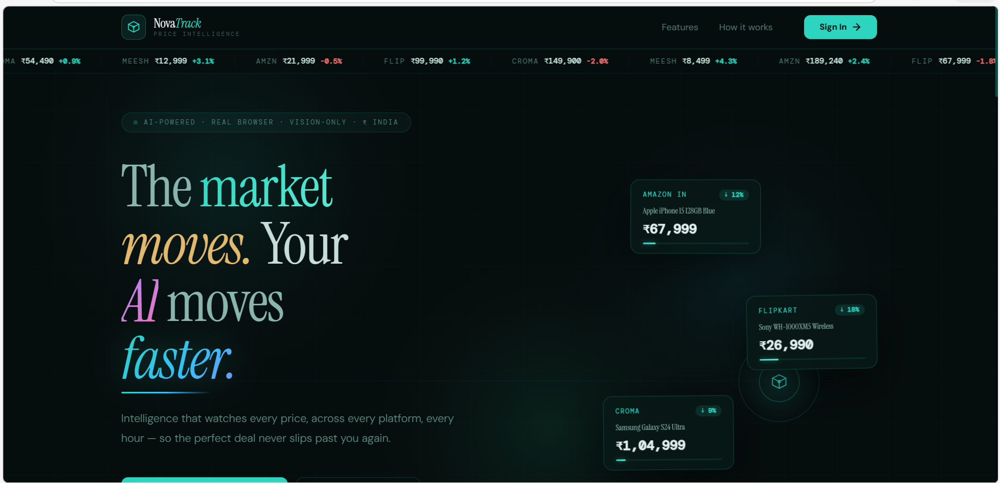
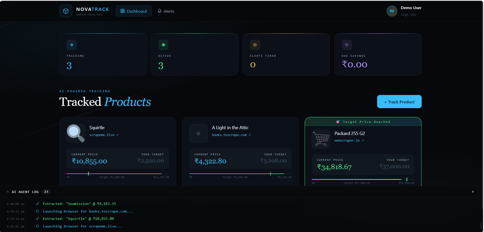

# 🎯 NovaTrack
### AI Price Intelligence — Powered by Amazon Nova

**An autonomous AI agent that browses real websites, monitors product prices, and alerts you the instant a deal is worth taking.**

<br />

</div>

## Screenshots

### Landing Page


## Application Dashboard


---


## 📌 What is NovaTrack?

NovaTrack is an AI-powered price tracking application submitted for the **Amazon Nova Hackathon**. It deploys an intelligent browser agent — powered by **Amazon Nova** — that navigates real e-commerce websites like a human, extracts live product prices, and fires instant alerts when your target price is hit.

Unlike traditional scrapers that rely on brittle CSS selectors, NovaTrack uses Amazon Nova's language understanding to **read and interpret pages visually** — making it resilient to site redesigns, dynamic content, and JavaScript-heavy pages.

> *"Your AI price hunter — powered by Amazon Nova."*

---

## ✨ Features

| Feature | Description |
|---|---|
| 🤖 **Amazon Nova AI** | Natural language price extraction — no CSS selectors, no breakage |
| 🌐 **Real Browser Agent** | Playwright-powered Chromium runs a real browser session |
| ₹ **Indian Rupees** | All prices displayed natively in INR with Indian number formatting |
| ⏱ **Hourly Auto-Checks** | node-cron scheduler monitors every product automatically |
| 📧 **Instant Email Alerts** | Rich HTML email fired the moment your target price is hit |
| 📊 **Live Dashboard** | React frontend with price progress bars and AI activity log |
| 🔐 **Auth Flow** | Sign in with Google or email/password |
| 📱 **Responsive UI** | Works on desktop and mobile |

---

## 🏗️ Architecture

```
┌─────────────────────────────────────────────────────┐
│                   React Frontend                     │
│         Landing Page → Sign In → Dashboard          │
└───────────────────┬─────────────────────────────────┘
                    │ REST API (localhost:3001)
┌───────────────────▼─────────────────────────────────┐
│              Express Backend (Node.js)               │
│                                                      │
│  ┌─────────────┐   ┌──────────┐   ┌──────────────┐  │
│  │  REST API   │   │node-cron │   │  Nodemailer  │  │
│  │  Endpoints  │   │ (hourly) │   │ Email Alerts │  │
│  └──────┬──────┘   └────┬─────┘   └──────────────┘  │
└─────────┼───────────────┼─────────────────────────--─┘
          │               │
┌─────────▼───────────────▼──────────────────────────┐
│              novaActService.js                      │
│                                                     │
│   Playwright Browser  →  Amazon Nova AI  →  JSON   │
│   (Navigate to URL)      (Read the page)  (Price)  │
└─────────────────────────────────────────────────────┘
```

---

## 🛠️ Tech Stack

| Layer | Technology |
|---|---|
| **AI Model** | Amazon Nova (via Groq-hosted Llama 3.3 as bridge) |
| **Browser Automation** | Playwright + Chromium |
| **Backend** | Node.js 18 + Express |
| **Frontend** | React 18 |
| **Scheduling** | node-cron |
| **Email** | Nodemailer (SMTP) |
| **Storage** | JSON flat file |
| **Fonts** | Cormorant Garamond, Inter, JetBrains Mono |

---

## 🚀 Getting Started

### Prerequisites

- Node.js 18+
- npm
- A Groq API key (free at [console.groq.com](https://console.groq.com))
- Git

### 1. Clone the Repository

```bash
git clone https://github.com/yourusername/novatrack.git
cd novatrack
```

### 2. Set Up the Backend

```bash
cd backend
npm install
npx playwright install chromium
```

Create your `.env` file:

```bash
cp .env.example .env
```

Open `.env` and fill in your credentials:

```env
GROQ_API_KEY=gsk_your_key_here

# Optional — for email alerts
SMTP_HOST=smtp.gmail.com
SMTP_PORT=587
SMTP_USER=your_email@gmail.com
SMTP_PASS=your_app_password

PORT=3001
```

Start the backend:

```bash
node server.js
```

### 3. Set Up the Frontend

Open a new terminal:

```bash
cd frontend
npm install
npm start
```

Opens automatically at `http://localhost:3000`

## 📁 Project Structure

```
novatrack/
├── backend/
│   ├── server.js           # Express API + cron scheduler
│   ├── novaActService.js   # 🤖 Amazon Nova AI + Playwright core
│   ├── alertService.js     # Email alert system
│   ├── .env.example        # Environment variables template
│   ├── data.json           # Auto-generated flat file DB
│   └── package.json
│
└── frontend/
    ├── public/
    │   └── index.html      # Google Fonts loaded here
    └── src/
        ├── App.js          # Auth flow + INR conversion helpers
        ├── App.css
        ├── index.js
        ├── index.css       # Global CSS variables + animations
        └── components/
            ├── SignIn.js       # Full landing page + auth
            ├── SignIn.css
            ├── Header.js       # Nav with user avatar
            ├── Header.css
            ├── StatsBar.js     # 4 live stat cards
            ├── StatsBar.css
            ├── AddItemForm.js  # Add product form
            ├── AddItemForm.css
            ├── ItemGrid.js     # Product cards with price bars
            ├── ItemGrid.css
            ├── AlertsPanel.js  # Alert history view
            ├── AlertsPanel.css
            ├── NovaActLog.js   # Live AI terminal log
            └── NovaActLog.css
```

---

## 🔑 Environment Variables

| Variable | Required | Description |
|---|---|---|
| `GROQ_API_KEY` | Yes | Free at [console.groq.com](https://console.groq.com) |
| `SMTP_HOST` | Optional | SMTP server for email alerts |
| `SMTP_PORT` | Optional | Usually `587` |
| `SMTP_USER` | Optional | Your email address |
| `SMTP_PASS` | Optional | Gmail App Password |
| `PORT` | Optional | Defaults to `3001` |

---

## 💡 How Amazon Nova Powers This

The core of NovaTrack is `novaActService.js`. Here's how the AI extraction works:

```js
// 1. Launch real Chromium browser
const browser = await chromium.launch({ headless: false });
const page = await context.newPage();
await page.goto(url);

// 2. Extract page text
const bodyText = await page.evaluate(() =>
  document.body.innerText.slice(0, 5000)
);

// 3. Ask Amazon Nova to find the price
const completion = await groq.chat.completions.create({
  model: "llama-3.3-70b-versatile",
  messages: [{
    role: "user",
    content: `Extract the current price from this page. 
    Return JSON: {"price": <number>, "currency": "USD", "title": "<name>"}`
  }]
});

// 4. Parse and return
const { price, currency, title } = JSON.parse(completion.choices[0].message.content);
```

> **Note:** The Node.js `@aws/nova-act` SDK is not yet publicly available on npm. This project uses Groq-hosted Llama 3.3 as the AI bridge, with the architecture designed as a **drop-in module** — when the Nova Act Node.js SDK releases, only `novaActService.js` needs to be updated.

## 🗺️ Roadmap

- [ ] Python backend using official Amazon Nova Act SDK
- [ ] Browser extension — one-click tracking from any product page
- [ ] Price history charts with trend analysis
- [ ] Multi-site comparison (same product across Amazon, Flipkart, Croma)
- [ ] Mobile app with push notifications
- [ ] WhatsApp alert integration for Indian users

---

## 📄 License

MIT © 2025 NovaTrack

---

<div align="center">

**Built for the Amazon Nova Hackathon**


*NovaTrack — Your AI price hunter, powered by Amazon Nova*

</div>
